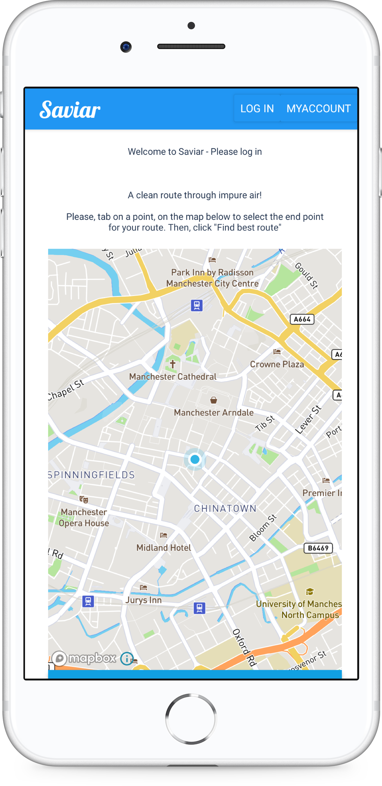

# Northcoders Final Project Backend

This repo contains the backend code for the Northcoders running app group project. The application that we built is a running app that will create a running route for the user, avoiding the most heavily polluted local areas. Built with Node.js, Express and MongoDB Atlas.

|               | Link                                                                                                 |
| ------------- | ---------------------------------------------------------------------------------------------------- |
| Backend API   | [https://running-app-backend.herokuapp.com/api](https://running-app-backend.herokuapp.com/api) |
| Frontend Repo | [https://github.com/tben140/Running-App-Frontend](https://github.com/tben140/Running-App-Frontend)   |

<p align="center">
    
</p>

## Getting Started

To run the project locally, clone this respository by running the code below in your terminal:

```bash
git clone https://github.com/tben140/Running-App-Backend.git
```

cd into the directory and install the required dependencies by running the following commands:

```bash
cd Running-App-Backend
npm install
```

You will need to create a .env file which should be git-ignored and should look like the below code:

```bash
DB_URI='mongodb+srv://<YOUR PROJECT NAME>:<YOUR PASSWORD>@<YOUR PROJECT NAME>-ze2oc.gcp.mongodb.net/<YOUR PROJECT NAME>?retryWrites=true&w=majority'
```

To seed your database on MongoDB Atlas you can run the `seed-atlas.js` file locally:

```bash
node seed-atlas.js
```

To run the tests use the command:

```bash
npm test
```

## Endpoints

The API has the following endpoints available to the user:

```HTTP
GET /api/users
POST /api/users
PATCH /api/users
GET /api/pollution-points
GET /api/pollution-points/:id
```
